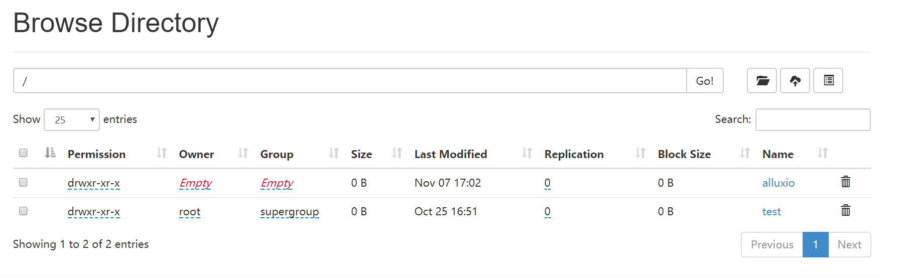

下载，解压，分发
```
cd /cloudstar/software
wget http://downloads.alluxio.org/downloads/files/1.6.1/alluxio-1.6.1-hadoop-2.8-bin.tar.gz
tar -zxvf alluxio-1.6.1-hadoop-2.8-bin.tar.gz 

scp -r /cloudstar/software/alluxio-1.6.1-hadoop-2.8  bigdata002:/cloudstar/software/
scp -r /cloudstar/software/alluxio-1.6.1-hadoop-2.8  bigdata003:/cloudstar/software/
scp -r /cloudstar/software/alluxio-1.6.1-hadoop-2.8  bigdata004:/cloudstar/software/
scp -r /cloudstar/software/alluxio-1.6.1-hadoop-2.8  bigdata005:/cloudstar/software/

```

配置环境变量
```
    vim ~/.bashrc
    
    export ALLUXIO_HOME=/cloudstar/software/alluxio-1.6.1-hadoop-2.8
    export PATH=$PATH:$ALLUXIO_HOME/bin

分发环境变量
    scp ~/.bashrc bigdata002:~/.bashrc
    scp ~/.bashrc bigdata003:~/.bashrc
    scp ~/.bashrc bigdata004:~/.bashrc
    scp ~/.bashrc bigdata005:~/.bashrc
    scp ~/.bashrc bigdata006:~/.bashrc
    scp ~/.bashrc bigdata007:~/.bashrc
    scp ~/.bashrc bigdata008:~/.bashrc
    scp ~/.bashrc bigdata009:~/.bashrc
    scp ~/.bashrc bigdata010:~/.bashrc

```

配置alluxio-env.sh文件
```
1.配置命令
cp ${ALLUXIO_HOME}/conf/alluxio-env.sh.template ${ALLUXIO_HOME}/conf/alluxio-env.sh
vim ${ALLUXIO_HOME}/conf/alluxio-env.sh

2.配置内容
export JAVA_HOME=/cloudstar/software/jdk1.8.0_151
export ALLUXIO_UNDERFS_ADDRESS=hdfs://bigdata002:9000
export ALLUXIO_UNDERFS_HDFS_IMPL=org.apache.hadoop.hdfs.DistributedFileSystem
export ALLUXIO_JAVA_OPTS+="
-Dalluxio.zookeeper.enabled=true
-Dalluxio.zookeeper.address=bigdata001:2181,bigdata002:2181,bigdata003:2181
-Dalluxio.master.journal.folder=${ALLUXIO_UNDERFS_ADDRESS}/alluxio/journal
-Dalluxio.master.bind.host=0.0.0.0
"


```

配置workers文件
此文件用于指定从节点，一行一个节点.
```
1.编辑命令
vim ${ALLUXIO_HOME}/conf/workers

2.配置内容
bigdata001
bigdata002
bigdata003
bigdata004
bigdata005
```

4.分发配置文件
```
scp -r ${ALLUXIO_HOME}/conf/*   bigdata002:${ALLUXIO_HOME}/conf/
scp -r ${ALLUXIO_HOME}/conf/*   bigdata003:${ALLUXIO_HOME}/conf/
scp -r ${ALLUXIO_HOME}/conf/*   bigdata004:${ALLUXIO_HOME}/conf/
scp -r ${ALLUXIO_HOME}/conf/*   bigdata005:${ALLUXIO_HOME}/conf/

```
启动Alluxio集群 
```
1格式化Alluxio集群
    ${ALLUXIO_HOME}/bin/alluxio format
2启动Alluxio集群
    ${ALLUXIO_HOME}/bin/alluxio-start.sh all Mount
```


验证Alluxio集群启动情况
```
1.命令验证
查看命令
jps
显示紧凑
AlluxioWorker
AlluxioMaster
AlluxioProxy

3.Web验证
http://bigdata001:19999

```
